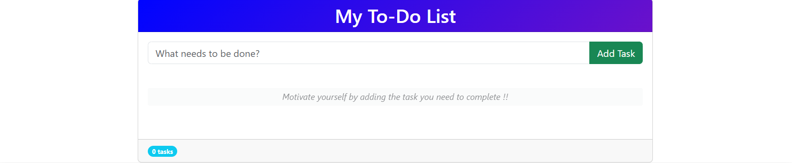
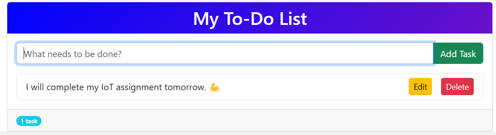
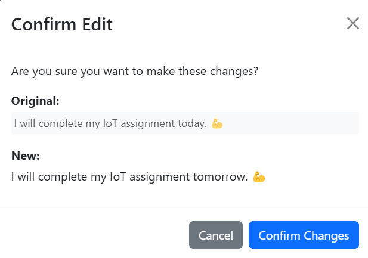
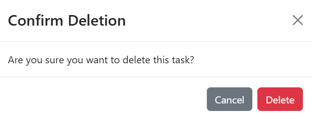

# 📝 To-Do List Application

A beautiful and responsive To-Do List application built with React and Bootstrap that helps you organize your tasks efficiently.

  

---

# ✨ Features

- ✅ Add, Edit, Delete tasks with intuitive UI

- 💾 Automatic saving to browser's localStorage

- 🎨 Modern design with Bootstrap components

- 📱 Fully responsive works on all devices

- 🔄 Smooth animations for better UX

- 🛡️ Confirmation dialogs for important actions

---

# 🚀 Quick Start

1. **Clone the repository:**
   ```bash
   git clone https://github.com/your-username/todo-list-react.git

2. **Install dependencies:**
   ```bash
    cd todo-list-react
    npm install
    
3. **Run the development server:**
   ```bash
   npm start

4. Open http://localhost:3000 in your browser


---

## 📸 Application Screenshots

| Feature | Screenshot |
|---------|-----------|
| **Adding a Task** |  |
| **Editing a Task** |  |
| **Delete Confirmation** |  |

---

## 📸 🛠️ Technologies Used

| Technology | Purpose |
|---------|-----------|
| **React 18** | Frontend framework |
| **Bootstrap 5** | UI components and styling |
| **React Bootstrap** | Pre-built React components |
| **localStorage** | Data persistence |
| **CSS3** | Custom styling and animations |

---

## Contributing 🤝
Contributions are welcome! If you have any suggestions, bug reports, or feature requests, please open an issue or submit a pull request.


